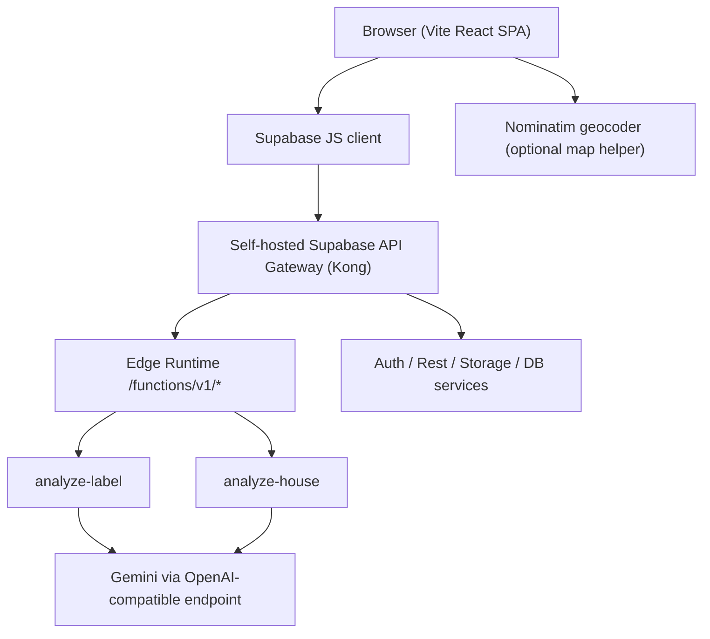

# Tauron Audit App - Detailed Technical Documentation

## 1. Purpose of This Document

This document is the in-depth technical reference for the `tauron_auditapp_hackaton` repository.

It complements:

- [`README.md`](./README.md) for quick local startup
- [`DEPLOY.md`](./DEPLOY.md) for deployment-oriented notes
- [`infra/supabase/README.md`](./infra/supabase/README.md) for the local Supabase runtime

Use this file when you need to understand how the application is structured, how data flows through it, which modules are important, and where the current implementation is intentionally simplified.

## 2. What the Application Does

The application is a single-page React app for the Polish energy market with three user-facing product surfaces:

1. **AGD label scanner**
   - Uploads a photo of an EU energy label.
   - Sends the image to a Supabase Edge Function.
   - Uses Gemini through an OpenAI-compatible endpoint to extract structured energy data.
   - Calculates annual energy use, tariff comparisons, standby costs, emissions, and savings suggestions.

2. **Smart grid simulator**
   - Lets the user build and modify a synthetic local energy network.
   - Simulates daily generation and consumption across houses, businesses, estates, transformers, and solar farms.
   - Supports linking/unlinking nodes, simple load/generation tuning, export/import of graph state, and a 24h balance chart.

3. **House audit / heat pump recommendation**
   - Uploads one or more building photos.
   - Sends them to a Supabase Edge Function for multimodal AI analysis.
   - Produces a structured building audit, risk flags, modernization plan, heat pump sizing guidance, ROI heuristics, and a downloadable PDF report.

## 3. High-Level Architecture

The application is technically simple at the route level but broad in feature scope.

- The browser loads a Vite-built SPA.
- The SPA has only one real page route: `/`.
- Internal navigation between the three product surfaces is controlled by component state, not URL routes.
- AI work is delegated to self-hosted Supabase Edge Functions running inside Docker.
- Edge Functions call Gemini directly through the Google Generative Language OpenAI-compatible endpoint.

## 4. Runtime Components

| Layer | Technology | Responsibility |
| --- | --- | --- |
| Frontend | React 18 + TypeScript + Vite | SPA rendering, local state, file upload, client-side calculations |
| UI system | Tailwind CSS + shadcn/ui + Radix + Framer Motion | Layout, controls, animations, charts, polish |
| Charts | Recharts | Energy cost charts, savings charts, grid charts |
| 3D visualization | `@react-three/fiber` + `@react-three/drei` + `three` | Building visualization in house audit results |
| Backend runtime | Supabase Edge Runtime | Hosts image-analysis functions |
| API client | `@supabase/supabase-js` | Invokes Edge Functions from the browser |
| AI provider | Gemini through OpenAI-compatible HTTP API | OCR-like extraction and multimodal building analysis |
| Geocoding | Nominatim | Address search helper for map-related UX |
| Local platform | Docker Compose | Runs frontend container and self-hosted Supabase stack |
| Optional remote delivery | Cloud Build + Cloud Run | Builds and serves the frontend image remotely |

## 5. Entry Points and Navigation Model

### 5.1 Frontend bootstrap

- [`src/main.tsx`](./src/main.tsx) mounts the React tree.
- [`src/App.tsx`](./src/App.tsx) wraps the app with:
  - `QueryClientProvider`
  - tooltip provider
  - two toaster systems
  - `BrowserRouter`

### 5.2 Routing

Current routes are minimal:

- `/` -> [`src/pages/Index.tsx`](./src/pages/Index.tsx)
- `*` -> [`src/pages/NotFound.tsx`](./src/pages/NotFound.tsx)

Important architectural detail:

- The three app surfaces are **not** separate URLs.
- [`src/pages/Index.tsx`](./src/pages/Index.tsx) keeps `activeTab` in local React state.
- The header switches between:
  - `scanner`
  - `grid`
  - `heatpump`

Implication:

- Deep-linking directly to a specific product surface is not implemented.
- Browser refresh always returns to the default tab unless state restoration is added later.

## 6. Repository Layout

### 6.1 Important source directories

| Path | Role |
| --- | --- |
| [`src/components/dashboard`](./src/components/dashboard) | AGD scan result widgets and calculators |
| [`src/components/heatpump`](./src/components/heatpump) | House audit result views, ROI tools, PDF generation, 3D building model |
| [`src/components/layout`](./src/components/layout) | Header and app-level navigation |
| [`src/components/map`](./src/components/map) | Smart-grid editor, graph controls, simulation charts |
| [`src/components/scanner`](./src/components/scanner) | Energy label upload flow |
| [`src/components/ui`](./src/components/ui) | Reusable shadcn/ui primitives |
| [`src/hooks`](./src/hooks) | Theme and utility hooks |
| [`src/integrations/supabase`](./src/integrations/supabase) | Supabase client and generated DB typings |
| [`src/lib`](./src/lib) | Core calculation logic, constants, graph models, local persistence helpers |
| [`src/pages`](./src/pages) | Route-level components |
| [`supabase/functions`](./supabase/functions) | Edge Functions used by the app |
| [`infra/supabase`](./infra/supabase) | Self-hosted Supabase Docker runtime |

### 6.2 Generated or runtime-heavy directories

These directories exist in the workspace but are not part of the business logic:

- `dist/` - built frontend assets
- `node_modules/` - package installation output
- `infra/supabase/volumes/db/data/` - live local Postgres data directory
- `infra/supabase/volumes/storage/` - local object storage content

Treat those as runtime artifacts, not source code to document or modify casually.

## 7. Product Surface 1: AGD Label Scanner

### 7.1 Frontend flow

Main files:

- [`src/components/scanner/PhotoUploader.tsx`](./src/components/scanner/PhotoUploader.tsx)
- [`src/components/dashboard/ResultsDashboard.tsx`](./src/components/dashboard/ResultsDashboard.tsx)
- [`src/lib/calculations.ts`](./src/lib/calculations.ts)
- [`src/lib/scan-history.ts`](./src/lib/scan-history.ts)

Flow:

1. User uploads or captures an energy-label image.
2. `PhotoUploader` reads the file as a Data URL.
3. It strips the base64 payload and sends it to Supabase Function `analyze-label`.
4. The function returns an `EnergyData` object.
5. [`src/pages/Index.tsx`](./src/pages/Index.tsx) stores the result in local state and local scan history.
6. `ResultsDashboard` generates a richer `FullCostReport` from that base result and current usage settings.

### 7.2 Data contract

Core interface from [`src/lib/types.ts`](./src/lib/types.ts):

- `device_type`
- `energy_class`
- `consumption_per_cycle_kwh`
- `consumption_per_100_cycles`
- `consumption_annual`
- `is_per_cycle`

The scanner therefore supports both:

- cycle-based devices like ovens, washing machines, dishwashers
- continuously running devices like fridges and TVs

### 7.3 Calculation model

Important logic in [`src/lib/calculations.ts`](./src/lib/calculations.ts):

- `calcAnnualKwh(...)`
  - For continuous devices, scales annual label consumption by actual hours/day and days/week.
  - For per-cycle devices, multiplies cycle consumption by weekly uses and 52 weeks.

- `calcCostBreakdown(...)`
  - Converts annual kWh into daily, weekly, monthly, and annual cost using one flat rate.

- `calcG12CustomCost(...)`
  - Splits annual kWh into peak and off-peak portions using `nightUsagePercent`.

- `calcStandbyCost(...)`
  - Uses keyword matching against a small standby-power dictionary in [`src/lib/constants.ts`](./src/lib/constants.ts).

- `generateFullReport(...)`
  - Aggregates G11 and G12 scenarios
  - adds CO2 estimate
  - adds 10-year cost projection
  - builds a weighted monthly cost profile

### 7.4 Scanner persistence

The AGD scanner uses browser storage only:

- Scan history is stored in `localStorage` under `tauron-scan-history`.
- Maximum stored entries: 20.
- There is no server-side persistence for scans.

### 7.5 Scanner UI composition

`ResultsDashboard` composes several focused widgets:

- usage configuration
- base cost card
- monthly chart
- G11 vs G12 comparison
- savings summary
- standby card
- dynamic tariff mock chart
- environmental impact
- macro impact
- tips
- print-based export

### 7.6 Important limitation

The dynamic tariff chart in [`src/components/dashboard/DynamicTariffChart.tsx`](./src/components/dashboard/DynamicTariffChart.tsx) uses **mock 24h tariff data**, not a live market feed.

## 8. Product Surface 2: Smart Grid Simulator

### 8.1 Core files

- [`src/components/map/GridMapComponent.tsx`](./src/components/map/GridMapComponent.tsx)
- [`src/components/map/NodeConfigPanel.tsx`](./src/components/map/NodeConfigPanel.tsx)
- [`src/components/map/GridDailyChart.tsx`](./src/components/map/GridDailyChart.tsx)
- [`src/components/map/GridStatsPanel.tsx`](./src/components/map/GridStatsPanel.tsx)
- [`src/lib/graph-types.ts`](./src/lib/graph-types.ts)

### 8.2 Interaction model

This feature is an in-browser graph editor, not a GIS-backed operational grid tool.

Capabilities:

- select nodes
- drag nodes
- add new nodes
- delete nodes
- create links
- remove links
- reset to seeded demo network
- enable/disable a day simulation
- export/import graph state as JSON

### 8.3 Node model

The graph is built from:

- `GraphNode`
  - identity and label
  - type (`house`, `business`, `estate`, `transformer`, `solar_farm`)
  - canvas position
  - optional lat/lng placeholders
  - consumption config
  - generation config

- `GraphEdge`
  - `from`
  - `to`
  - `flow_kw`

### 8.4 Simulation heuristics

Key helpers in [`src/lib/graph-types.ts`](./src/lib/graph-types.ts):

- `pvMultiplier(hour)` -> bell-curve solar output around midday
- `consumptionMultiplier(hour, type)` -> different profile for residential vs business
- `windMultiplier(hour)` -> deterministic sinusoidal pseudo-randomness
- `getSimulatedConsumption(...)`
- `getSimulatedGeneration(...)`
- `getNodeBalance(...)`
- `getNodeStatus(...)`

This produces an educational and visually intuitive simulation, but it is not a physical power-flow solver.

### 8.5 Export/import behavior

`GridStatsPanel` exports the current graph to a local JSON file and can import that same structure back.

This is currently the only persistence mechanism for the smart-grid surface.

### 8.6 Related but currently unwired code

Two map-adjacent modules exist but are not wired into `GridMapComponent` right now:

- [`src/components/map/AddressSearch.tsx`](./src/components/map/AddressSearch.tsx)
- [`src/lib/geo-mocks.ts`](./src/lib/geo-mocks.ts)

That suggests the codebase has room for future geospatial expansion, but the active implementation is the SVG graph editor.

## 9. Product Surface 3: House Audit and Heat Pump Recommendation

### 9.1 Core files

- [`src/components/heatpump/HouseAuditor.tsx`](./src/components/heatpump/HouseAuditor.tsx)
- [`src/components/heatpump/HeatPumpResult.tsx`](./src/components/heatpump/HeatPumpResult.tsx)
- [`src/components/heatpump/PdfReportButton.tsx`](./src/components/heatpump/PdfReportButton.tsx)
- [`src/components/heatpump/ModernizationPlan.tsx`](./src/components/heatpump/ModernizationPlan.tsx)
- [`src/components/heatpump/ScenarioComparison.tsx`](./src/components/heatpump/ScenarioComparison.tsx)
- [`src/components/heatpump/Building3DModel.tsx`](./src/components/heatpump/Building3DModel.tsx)

### 9.2 Upload flow

`HouseAuditor` supports up to six labeled photo slots:

- front
- back
- left
- right
- roof
- detail

Each image is converted to base64 and submitted to the `analyze-house` Edge Function.

The function returns a large structured audit object including:

- building type
- estimated year and floor count
- heated area
- envelope quality
- solar potential
- thermal bridges
- moisture and airtightness
- heat demand
- cost comparison
- geometry
- risk flags
- heat loss distribution
- confidence scores

### 9.3 Post-analysis derived values

`HeatPumpResult` adds client-side heuristics on top of the AI response:

- estimated heat demand in kW
- nearest recommended heat pump size
- installation cost heuristic
- subsidy heuristic based on insulation quality
- ROI and annual savings
- rough CO2 comparison

These values are not produced by the backend alone; the frontend enriches them.

### 9.4 Result experience

The house audit is the largest feature area in the repository. It includes:

- envelope summary
- 3D building model with photo textures or placeholders
- envelope inventory
- heat-loss map
- risk flag visualization
- heating overview
- solar potential summary
- what-if simulator
- scenario comparison
- modernization planning timeline
- PDF report generation

### 9.5 PDF generation

`PdfReportButton` uses `jsPDF` in the browser to generate a multi-page audit document.

The PDF includes:

- cover/header
- first building photo
- expert summary
- envelope findings
- heating recommendation
- solar potential
- annual cost comparison
- financial analysis
- staged modernization plan

This is a fully client-side export. No server-side report generation exists.

## 10. AI and Backend Integration

### 10.1 Edge Function routing model

The local Supabase Edge Runtime does not expose each function manually through custom glue code in the frontend.

Instead:

- [`supabase/functions/main/index.ts`](./supabase/functions/main/index.ts) acts as the main service.
- It inspects the request path.
- It creates a worker for the requested function directory using `EdgeRuntime.userWorkers.create(...)`.
- Docker config points the Edge Runtime at `/home/deno/functions/main` as the main service.

This is an important infrastructure detail when debugging local function dispatch.

### 10.2 Shared AI transport

Shared helpers live in:

- [`supabase/functions/_shared/gemini.ts`](./supabase/functions/_shared/gemini.ts)
- [`supabase/functions/_shared/http.ts`](./supabase/functions/_shared/http.ts)

Responsibilities:

- environment variable loading
- upstream request formatting
- OpenAI-compatible `chat/completions` call
- basic upstream error mapping
- JSON cleanup and parsing
- CORS and JSON request validation

### 10.3 `analyze-label`

[`supabase/functions/analyze-label/index.ts`](./supabase/functions/analyze-label/index.ts):

- accepts a base64 image and MIME type
- sends a system prompt telling Gemini to behave like an EU energy-label expert
- expects raw JSON only
- performs minimal structural sanity checks
- normalizes missing numeric fields to `null`

### 10.4 `analyze-house`

[`supabase/functions/analyze-house/index.ts`](./supabase/functions/analyze-house/index.ts):

- accepts one image or an array of labeled images
- builds a large multimodal auditor prompt
- asks for an extensive JSON structure
- returns parsed JSON directly

Important implementation note:

- `analyze-house` currently trusts the model output more than `analyze-label` does.
- There is no strong schema validation layer beyond JSON parsing.

## 11. State Management and Persistence

The codebase is mostly local-state driven.

### 11.1 What is persisted

- theme -> `localStorage`
- AGD scan history -> `localStorage`
- smart-grid configuration -> optional manual JSON export/import
- house audit PDF -> downloaded client-side file

### 11.2 What is not persisted

- AGD scan results in Supabase tables
- graph data in database
- audit results in database
- user profiles or auth-backed settings

### 11.3 React Query status

`App.tsx` sets up a `QueryClientProvider`, but the current app mostly uses:

- direct function calls through Supabase client
- regular React local state

So React Query is provisioned but not yet central to the data flow.

## 12. Supabase and Data Layer Status

The generated database type in [`src/integrations/supabase/types.ts`](./src/integrations/supabase/types.ts) shows no application tables, views, functions, or enums in `public`.

That matches the current implementation:

- the application is effectively **function-driven**, not database-driven
- Supabase is used primarily as:
  - API gateway
  - auth/rest/storage platform runtime
  - Edge Function host

The app does not currently appear to rely on custom SQL schema or business tables.

## 13. Environment Variables and Configuration

### 13.1 Frontend environment

Defined in:

- [`.env.example`](./.env.example)
- [`src/vite-env.d.ts`](./src/vite-env.d.ts)

Variables:

- `VITE_SUPABASE_URL`
- `VITE_SUPABASE_PUBLISHABLE_KEY`
- `VITE_GEOCODER_URL`

### 13.2 Runtime deployment secret

Defined in:

- [`deployment.env.example`](./deployment.env.example)

Required user-provided secret for local Docker deployment:

- `GEMINI_API_KEY`

### 13.3 Supabase runtime config

Main file:

- [`infra/supabase/deployment.env`](./infra/supabase/deployment.env)

Important values there:

- Supabase service credentials
- local URLs and ports
- storage config
- Edge Function config
- `AI_BASE_URL`
- `AI_MODEL_LABEL`
- `AI_MODEL_HOUSE`
- `FUNCTIONS_VERIFY_JWT`

## 14. Local Development and Execution

### 14.1 Main commands

From [`package.json`](./package.json):

- `npm run dev`
- `npm run build`
- `npm run lint`
- `npm run test`
- `npm run docker:up`
- `npm run docker:down`

### 14.2 Docker Compose structure

Root [`docker-compose.yml`](./docker-compose.yml):

- includes [`infra/supabase/docker-compose.yml`](./infra/supabase/docker-compose.yml)
- builds the frontend container
- passes `VITE_*` build args into the frontend image
- publishes the frontend on `8080` by default

The included Supabase stack runs:

- Kong
- Auth
- Rest
- Realtime
- Storage
- Imgproxy
- Meta
- Edge Functions
- DB
- Supavisor

Optional `ops` profile adds:

- Studio
- Analytics
- Vector

## 15. Frontend Build and Web Serving

### 15.1 Vite config

[`vite.config.ts`](./vite.config.ts):

- uses `@vitejs/plugin-react-swc`
- exposes alias `@ -> ./src`
- runs dev server on port `8080`
- includes `lovable-tagger` in development mode

### 15.2 Dockerfile

[`Dockerfile`](./Dockerfile) uses a two-stage build:

1. Node 20 Alpine build stage
2. Nginx runtime stage

The frontend is built at image-build time, which means `VITE_*` values are compile-time inputs.

### 15.3 Nginx config

[`nginx.conf`](./nginx.conf):

- serves the SPA
- caches hashed `/assets/` aggressively
- disables caching for `index.html`
- provides `try_files` SPA fallback
- exposes `/healthz` for Cloud Run health checks

## 16. Optional Remote Deployment Path

[`cloudbuild.yaml`](./cloudbuild.yaml) is an optional pipeline for building and deploying the frontend image to Cloud Run.

It:

1. builds the Docker image with `VITE_*` build args
2. pushes SHA and `latest` tags to Artifact Registry
3. deploys the image to Cloud Run

Important caveat:

- This pipeline covers the **frontend image**, not the full local self-hosted Supabase stack.
- The repository's primary target remains local Docker Compose.

## 17. Styling and UX System

Styling is centered on Tailwind plus CSS variables.

Important files:

- [`tailwind.config.ts`](./tailwind.config.ts)
- [`src/index.css`](./src/index.css)

Notable details:

- light and dark themes are controlled via CSS variables
- theme switching is implemented by toggling the `dark` class on `document.documentElement`
- primary branding color is a custom `tauron` token
- typography uses:
  - `Inter` for body text
  - `Space Grotesk` for headings

## 18. Testing and Quality Status

### 18.1 Current tests

Vitest is configured in [`vitest.config.ts`](./vitest.config.ts), with setup in [`src/test/setup.ts`](./src/test/setup.ts).

Current test coverage is minimal:

- [`src/test/example.test.ts`](./src/test/example.test.ts) is only a placeholder passing test

### 18.2 Practical implication

The project currently relies much more on manual UI validation and local feature testing than on automated regression coverage.

## 19. Current Constraints, Risks, and Simplifications

The repository is functional, but several areas are intentionally lightweight or incomplete:

1. **Single real route**
   - Feature switching is not URL-driven.

2. **No durable business persistence**
   - Results live in browser state or downloads, not app tables.

3. **AI responses are only partially validated**
   - Especially for `analyze-house`.

4. **Dynamic tariff data is mocked**
   - Not tied to real tariff or exchange feeds.

5. **Smart-grid simulation is heuristic**
   - It is not a physical or market-accurate power-flow engine.

6. **Geocoder is external and unauthenticated**
   - Nominatim usage may be rate-limited in real deployment.

7. **Test coverage is effectively absent**
   - There is no meaningful automated protection for key calculations or UI flows.

8. **Supabase platform breadth exceeds app usage**
   - The self-hosted stack is broad, while the app currently uses only a subset of it.

## 20. Recommended Next Engineering Steps

If this project is to move beyond hackathon/demo maturity, the highest-value next steps are:

1. Add schema validation for AI responses with `zod` in both Edge Functions.
2. Persist scan and audit sessions in Supabase tables instead of browser-only state.
3. Add route-based navigation for `/scanner`, `/grid`, and `/audit`.
4. Replace mock tariff data with a real tariff or market-price integration.
5. Add unit tests for `src/lib/calculations.ts` and `src/lib/graph-types.ts`.
6. Add end-to-end tests for the three main user flows.
7. Decide whether the smart-grid feature is a demo sandbox or a future production module, then simplify or deepen it accordingly.

## 21. Fast Onboarding Checklist

For a new engineer entering the repo, the fastest useful reading order is:

1. [`README.md`](./README.md)
2. [`package.json`](./package.json)
3. [`src/pages/Index.tsx`](./src/pages/Index.tsx)
4. [`src/lib/calculations.ts`](./src/lib/calculations.ts)
5. [`src/lib/graph-types.ts`](./src/lib/graph-types.ts)
6. [`src/components/heatpump/HouseAuditor.tsx`](./src/components/heatpump/HouseAuditor.tsx)
7. [`src/components/heatpump/HeatPumpResult.tsx`](./src/components/heatpump/HeatPumpResult.tsx)
8. [`supabase/functions/analyze-label/index.ts`](./supabase/functions/analyze-label/index.ts)
9. [`supabase/functions/analyze-house/index.ts`](./supabase/functions/analyze-house/index.ts)
10. [`docker-compose.yml`](./docker-compose.yml) and [`infra/supabase/docker-compose.yml`](./infra/supabase/docker-compose.yml)

That sequence gives the clearest picture of:

- what the app does
- how the user flows work
- how the AI boundary is implemented
- how the local runtime is assembled
